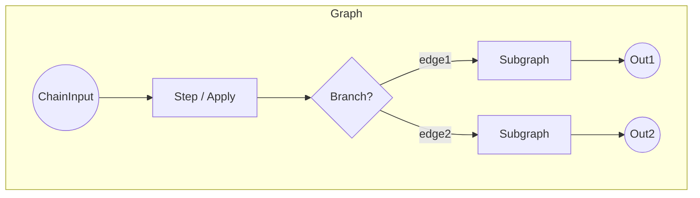

# Chainette Elegance Refactor Plan

> Branch: `elegance`

This document is the living blueprint for turning Chainette's execution core (Node → Step → Chain, etc.) into a cleaner, more algorithmically elegant architecture while preserving the guiding principles captured in `llm.txt`.

## 1 – Current State (June 2025)

### Strengths
1. **Type-safety** via Pydantic throughout.
2. JSON-schema guided decoding working for vLLM *and* Ollama.
3. Runs produce fully reproducible artefacts on disk.

### Pain Points
| Area | Issue |
|------|-------|
|Chain execution|Imperative loop with many `if`/`elif` branches, manual engine release; difficult to extend (e.g. nested branches, joins, async).|
|Node hierarchy|`Branch` is a special-cased list — not a first-class `Node`; violates LSP.| 
|Prompt building|Done inside `Step._build_prompt`, but `Step.execute` also manages batching, engine, histories — SRP violation.| 
|Engine life-cycle|Spread across `Chain` and `Step`; needs separation.| 
|Batching|Implemented per Step with indexes; cannot stream or parallelise easily.| 
|Error handling|Nested try/except, no structured failure propagation.| 

## 2 – Target Architecture

Key ideas:
1. **True DAG** of `Node`s. Each Node knows its downstream connections; `Chain` just keeps a root list.
2. **Composite pattern**: `Branch` (or any parallel container) is itself a `Node` holding an internal `Graph`.
3. **Execution engine**: separate service that walks the DAG depth-first or breadth-first, handles batching & engine reuse generically.
4. **Engine pool** abstraction with context-manager semantics; `Step` only asks for `with EnginePool(engine_name) as engine:`.
5. **PromptRenderer** utility class.
6. **BaseResult** object carries value *and* metadata (reasoning, timing, errors).

## Guiding Principle – Keep It Tiny & Readable

Chainette must remain a **tiny (~≤500 LOC core)**, approachable codebase:
• Favour explicit, straightforward constructs over clever abstractions.
• Each module should fit on one screen (<150 LOC) when possible.
• Zero hidden magic; public API ≈ internal flow.
• New dependencies require strong justification.

(Every change below must be evaluated against this principle.)

## 3 – Roadmap / TODO  (updated)

- [ ] **Design docs** – detailed diagrams + LOC budget for each new module.
- Graph layer
  - [x] Introduce `graph.py` with `Node`, `Edge`, `Graph` (<120 LOC).
  - [x] Provide `.connect(node)` helper for fluent graph building.
- Branch composite
  - [x] Refactor `Branch` → subclass `CompositeNode` in ≤40 LOC.
- Execution engine
  - [ ] Create `executor.py` (≤150 LOC) with generic DAG walker.
  - [ ] Batching/engine-reuse logic lives here; Step becomes thin wrapper.
- Prompt renderer
  - [ ] `prompt.py` (≤80 LOC) – pure functions, no side-effects.
  - [ ] `context.py` (≤50 LOC) – builds rendering context from histories.
- Engine pool
  - [ ] `pool.py` (≤60 LOC) – context manager + simple LRU of live engines.
- Step refactor
  - [ ] Remove batching/prompt logic; delegate to renderer & executor.
  - [ ] Target ≤120 LOC total.
- Chain facade
  - [ ] Keep current `Chain` API but proxy to `Graph`/`Executor`.
- Error model
  - [ ] Define `Result` dataclass with `value | error` (≤30 LOC).
- Async option
  - [ ] Optional `AsyncExecutor` (≤120 LOC) using `anyio`.
- Docs & style
  - [ ] Update README + `llm.txt` to reflect new architecture.
  - [ ] Add `CONTRIBUTING.md` emphasising simplicity rule.
- Tests
  - [ ] Unit tests for graph traversal, pooling, renderer.
  - [x] Integration tests: Ollama Gemma chain covering Steps, Apply, Branches (`ollama_gemma_features.py`).
  - [ ] Static graph validation tests (model I/O compatibility).
- Logging
  - [ ] Centralised structured logger with verbosity levels (<40 LOC).
- DSL / Builder
  - [ ] Design a fluent DSL for pipeline construction (e.g. `qa >> filter >> (fr | es)`).
  - [ ] Evaluate two syntaxes:
      1. **Operator DSL** (`>>`, `|`) pure-Python, no new deps.
      2. **Declarative dict/YAML** for data-driven chains (good for CLI).
  - [ ] Prototype operator DSL with minimal metaprogramming (<40 LOC).
  - [ ] Prototype YAML loader that converts to `Graph` (<60 LOC).
  - [ ] Define YAML schema (engines, models, steps, branches) & example file.
  - [ ] Extend CLI: `chainette run-yaml my_chain.yml -o out_dir`.
  - [ ] Add validation against JSON-Schema.
  - [ ] Support joins/branch IDs explicitly (`join_on="id"`).
  - [ ] Maintain backwards-compat with `

## 5 – Open Questions / Risks

| Topic | Concern | Mitigation |
|-------|---------|-----------|
|YAML loader|YAML can be verbose / error-prone and may bloat code > target LOC.|Keep loader optional; fail fast with schema validation; reuse `ruamel.yaml` only if needed.|
|Operator DSL magic|Over-using `__rrshift__`/`__or__` may confuse users.|Provide clear docs + fall back to explicit `connect()` API.|
|Concurrency|Async executor adds complexity.|Ship synchronous path first; async as opt-in feature.|
|Security|Arbitrary YAML could execute tags.|Disable YAML tags; validate strictly.|
|Performance|LRU EnginePool may thrash for large DAGs.|Expose pool size option; benchmark.|

## 6 – Missing Items (added)

- Streaming token support in Executor (optional, maintain small code by callback hooks).
- Metrics / tracing: expose simple event hooks (start/end node) for latency measurement (<40 LOC).
- Error handling strategy: propagate structured errors, allow retry policy node (future work).
- CLI sub-command `chainette graph` to visualise DAG via Mermaid export.