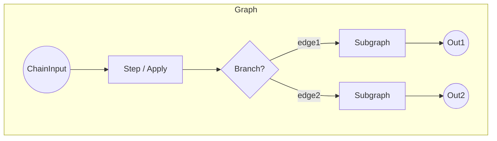

# Chainette Elegance Refactor Plan

> Branch: `elegance`

This document is the living blueprint for turning Chainette's execution core (Node → Step → Chain, etc.) into a cleaner, more algorithmically elegant architecture while preserving the guiding principles captured in `llm.txt`.

## 1 – Current State (June 2025)

### Strengths
1. **Type-safety** via Pydantic throughout.
2. JSON-schema guided decoding working for vLLM *and* Ollama.
3. Runs produce fully reproducible artefacts on disk.

### Pain Points
| Area | Issue |
|------|-------|
|Chain execution|Imperative loop with many `if`/`elif` branches, manual engine release; difficult to extend (e.g. nested branches, joins, async).|
|Node hierarchy|`Branch` is a special-cased list — not a first-class `Node`; violates LSP.| 
|Prompt building|Done inside `Step._build_prompt`, but `Step.execute` also manages batching, engine, histories — SRP violation.| 
|Engine life-cycle|Spread across `Chain` and `Step`; needs separation.| 
|Batching|Implemented per Step with indexes; cannot stream or parallelise easily.| 
|Error handling|Nested try/except, no structured failure propagation.| 

## 2 – Target Architecture

Key ideas:
1. **True DAG** of `Node`s. Each Node knows its downstream connections; `Chain` just keeps a root list.
2. **Composite pattern**: `Branch` (or any parallel container) is itself a `Node` holding an internal `Graph`.
3. **Execution engine**: separate service that walks the DAG depth-first or breadth-first, handles batching & engine reuse generically.
4. **Engine pool** abstraction with context-manager semantics; `Step` only asks for `with EnginePool(engine_name) as engine:`.
5. **PromptRenderer** utility class.
6. **BaseResult** object carries value *and* metadata (reasoning, timing, errors).

## 3 – Roadmap / TODO

- [ ] **Design docs** – flesh out data-flow & class diagrams (this file will grow).
- [ ] **Introduce `Graph` & `Edge` classes** (non-breaking, unused at first).
- [ ] **Refactor `Branch` to extend `Node` and hold internal `Graph`**.
- [ ] **Extract `EnginePool`** from `chain.core` into `chainette.engine.pool`.
- [ ] **Move prompt logic to `PromptRenderer` (utils/prompt.py)**.
- [ ] **Re-implement `Step.execute` using new renderer & EnginePool**.
- [ ] **Rewrite `Chain.run` into generic DAG walker** (supports recursion, joins later).
- [ ] **Introduce async execution path** (optional) with `anyio`.
- [ ] **Back-compat shim**: keep current API surface (`Chain.run`, etc.).
- [ ] **Comprehensive tests** with Ollama Gemma for happy path, plus unit tests for Graph traversal.

## 4 – Acceptance Criteria
1. All existing examples (`ollama_gemma_test`, `product_struct_extract`, etc.) still run unchanged.
2. Code coverage for new core ≥ 80 %.
3. No performance regression vs current implementation on 100-item batch.

---
Next step: **detail design of `Graph` & execution engine** (PR 1). 