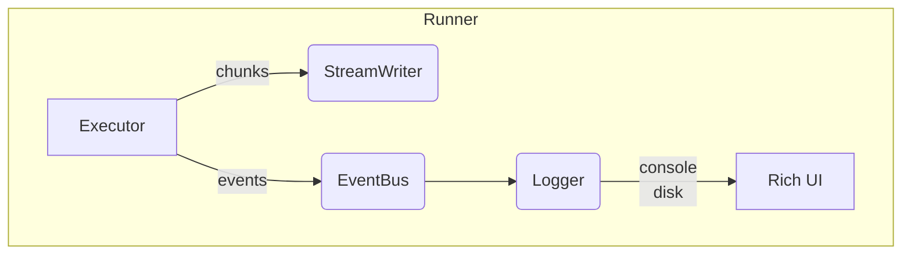

# Chainette Runner Refactor Plan

> Branch: `runner`

This document is the living blueprint for upgrading Chainette's *execution runtime* – batching, writer, and logging – to comfortably handle **millions of rows** while keeping the console output crisp and beautiful, in line with `llm.txt`'s *tiny-but-powerful* philosophy.

## 1 – Motivation (June 2025)

| Area | Issue |
|------|-------|
|Batching|`Executor` keeps full input/output lists in RAM; writer buffers all rows until `finalize()`. With ≥1 M docs this explodes memory & crashes.|
|Writer|`RunWriter` ignores `max_lines_per_file`, always writes a single `0.jsonl`; flattened output done **after** full load ⇒ O(N) memory again; lacks Parquet support & join-aware merging.|
|Logging|Console floods with prints; no high-level DAG view; progress impossible to follow on big runs; aesthetics nowhere near [DataTrove](https://github.com/supercowpowers/datatrove).|

## 2 – Target Architecture

Key ideas:
1. **Chunked execution**: `Executor` becomes an *iterator* that yields item-batches → Writer flushes each batch immediately, freeing RAM.
2. **StreamWriter**: new drop-in replacement for `RunWriter` that
   • honours `max_lines_per_file` per split,
   • supports *parquet* & *jsonl* out of the box,
   • flattens rows *on-the-fly* (no full merge in memory),
   • is **join-aware** – merged columns follow `<alias>.<field>` convention.
3. **EventBus**: lightweight pub/sub (≤40 LOC). Executor publishes `BatchStarted`, `StepFinished`, … events; Logger subscribes.
4. **Rich Logger**: pretty console powered by *rich*:
   • tree view of validated DAG before execution,
   • live `Progress` bars per Step (total items & completed),
   • compact debug panel toggle via `--verbose`.
5. **Backwards compatibility**: keep old API (`RunWriter`, `debug=True` prints) behind feature flag so existing scripts keep working.

## 3 – Roadmap / TODO  (updated)

- [ ] **Design docs** – detail StreamWriter & EventBus API + LOC budget (<120 LOC combined).
- Executor
  - [x] Refactor `Executor.run` to *yield batches* instead of returning full lists (added `run_iter`).
  - [x] Release references to processed batches (`del` → encourage GC).
- StreamWriter
  - [x] Implement incremental write with rolling filenames `