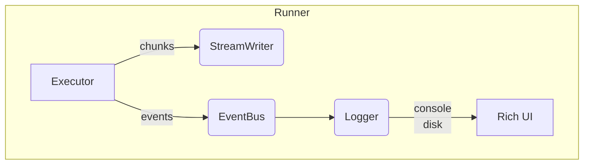

# Chainette Runner Refactor Plan

> Branch: `runner`

This document is the living blueprint for upgrading Chainette's *execution runtime* – batching, writer, and logging – to comfortably handle **millions of rows** while keeping the console output crisp and beautiful, in line with `llm.txt`'s *tiny-but-powerful* philosophy.

## 1 – Motivation (June 2025)

| Area | Issue |
|------|-------|
|Batching|`Executor` keeps full input/output lists in RAM; writer buffers all rows until `finalize()`. With ≥1 M docs this explodes memory & crashes.|
|Writer|`RunWriter` ignores `max_lines_per_file`, always writes a single `0.jsonl`; flattened output done **after** full load ⇒ O(N) memory again; lacks Parquet support & join-aware merging.|
|Logging|Console floods with prints; no high-level DAG view; progress impossible to follow on big runs; aesthetics nowhere near [DataTrove](https://github.com/supercowpowers/datatrove).|

## 2 – Target Architecture



Key ideas:
1. **Chunked execution**: `Executor` becomes an *iterator* that yields item-batches → Writer flushes each batch immediately, freeing RAM.
2. **StreamWriter**: new drop-in replacement for `RunWriter` that
   • honours `max_lines_per_file` per split,
   • supports *parquet* & *jsonl* out of the box,
   • flattens rows *on-the-fly* (no full merge in memory),
   • is **join-aware** – merged columns follow `<alias>.<field>` convention.
3. **EventBus**: lightweight pub/sub (≤40 LOC). Executor publishes `BatchStarted`, `StepFinished`, … events; Logger subscribes.
4. **Rich Logger**: pretty console powered by *rich*:
   • tree view of validated DAG before execution,
   • live `Progress` bars per Step (total items & completed),
   • compact debug panel toggle via `--verbose`.
5. **Backwards compatibility**: keep old API (`RunWriter`, `debug=True` prints) behind feature flag so existing scripts keep working.

## 3 – Roadmap / TODO  (updated)

- [ ] **Design docs** – detail StreamWriter & EventBus API + LOC budget (<120 LOC combined).
- Executor
  - [ ] Refactor `Executor.run` to *yield batches* instead of returning full lists.
  - [ ] Release references to processed batches (`del` → encourage GC).
- StreamWriter
  - [x] Implement incremental write with rolling filenames `000.jsonl`, `001.jsonl`, … per split.
  - [x] Add Parquet support via `pyarrow` (optional extra).
  - [x] Implement `flatten_row(batch_dict)` generator so flattening never loads full datasets (handled in StreamWriter).
  - [x] Unit tests: basic jsonl & parquet chunking (RAM stress test pending).
- EventBus / Logger
  - [x] Tiny `events.py` with `@dataclass` events + `subscribe/publish` helpers.
  - [ ] Logger module v2: rich `Tree`, per-step `Progress`, coloured levels.
  - [ ] CLI: `chainette run` prints DAG tree then live progress.
  - [ ] Add `--quiet` & `--json-logs` flags.
- CLI & Config
  - [x] New `--stream-writer` flag defaults *on* when batch_size > 0 (basic flag added; default logic pending).
  - [ ] `chainette inspect` to display tree only (no run).
- Docs
  - [ ] Add *Runner* section in README & snippet in `llm.txt`.
- Examples
  - [ ] `examples/runner/huge_batch_demo.py` (uses dummy apply nodes to process 1 M rows quickly).
- Tests
  - [ ] Stress test: pytest benchmarks memory under 512 MB for 1 M rows.
  - [ ] Snapshot test of DAG tree output (rich console capture).
- Developer Workflow Checklist (for each TODO)
  1. `poetry install -E ollama`
  2. Ensure `ollama serve` running.
  3. After each completed item:
     ```bash
     poetry run chainette run examples/ollama_gemma_features.py full_chain inputs2.jsonl _tmp_run_runner
     pytest -q
     ```
  4. Inspect `_tmp_run_runner/flattened/*.jsonl` for correctness.
  5. Commit with a code snippet under the checked item.

    Example snippet placeholder:
    ```python
    # core/executor.py (excerpt)
    for batch in _iter_batches(inputs, self.batch_size):
        yield self._run_batch(batch)
    ```

## 4 – LOC Budget

| Module | Max LOC |
|--------|---------|
|core/executor.py (diff)| +40 |
|io/stream_writer.py | ≤120 |
|utils/events.py | ≤40 |
|utils/logging_v2.py | ≤80 |
|cli.py (diff) | +50 |

## 5 – Acceptance Criteria

1. Running `huge_batch_demo.py` with 1 M rows uses <500 MB RAM.
2. Files are chunked correctly (`000.jsonl`, `001.jsonl`, …).
3. Flattened output for join chains passes schema validation.
4. Console shows DAG tree + live progress matching DataTrove style.
5. All existing tests + new tests pass: `pytest -q`. 