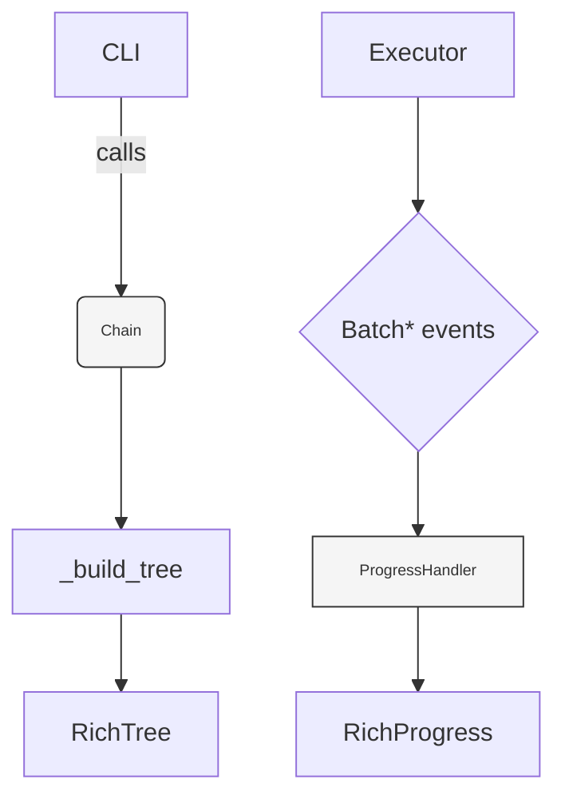

# Chainette UI Refactor Plan – DAG & Progress

> Branch: `dag-ui`

This living document designs two UX improvements:

• Beautiful, tree-shaped rendering of the execution DAG (branches, joins, parallel lists).  
• Accurate live progress bars that advance smoothly instead of the current 0 → 100 jump.

-----------------------------------------------------------------------------
## 0 – Context Snapshot (June 2025)

*Current* (`engine-api`):

• `utils.logging_v2.show_dag_tree(step_ids)` prints a **flat** list of step IDs.  
• `Progress` tasks are created lazily on first `BatchStarted`, total is mutated, and we only call `advance` once per batch → with the usual `batch_size == len(inputs)` the bar jumps from 0 % to 100 %.

-----------------------------------------------------------------------------
## 1 – Design Goals

G1. **Hierarchical DAG rendering**: nested `rich.tree.Tree` that mirrors actual execution order, including nested branches and `JoinBranch`.  
G2. **Smooth progress**: each task's percentage should increase every time we finish a *batch*, not just at the end.  
G3. **Zero extra deps**: continue to rely only on `rich`.  
G4. **Keep LOC ≤ 120** across all new/modified files.  
G5. **Type-safe, side-effect-free helpers** so inspection can be reused by CLI and tests.

-----------------------------------------------------------------------------
## 2 – Target Architecture



Key pieces (all under `utils/`):

1. **`dag.py`** – pure helper, no Rich import.
   ```python
   def iter_nodes(chain: Chain) -> list[tuple[int, Node|Branch]]: ...
   def build_rich_tree(chain: Chain) -> Tree:   # side-effect-free
       ...
   ```
2. **`logging_v3.py`** – supersedes `logging_v2.py` but preserves API.  
   • Maintains per-step progress tasks.  
   • Uses new `StepTotalItems` event for correct totals (see §3.2).

-----------------------------------------------------------------------------
## 3 – Implementation Tasks

### 3.1 DAG rendering

- [x] **Add `utils.dag.iter_nodes`**  
      Recursive generator that yields `(depth, obj)` for `Step`, `Branch`, `JoinBranch`.  
      Depth-first left-to-right ordering identical to `Executor`.
- [x] **Add `utils.dag.build_rich_tree`**  
      Converts iterator into a `rich.tree.Tree`, adding a coloured label per node type:  
      • Step → cyan, show `emoji` if present.  
      • Branch → magenta ⤷ children indented.  
      • Parallel branches (list) → grey group node "parallel ⨉ N".
- [x] **Replace `utils.logging_v2.show_dag_tree`**  
      Keep name for backwards compatibility; internally call new helper.

### 3.2 Fine-grained progress

1. **New event** in `utils.events`  
   ```python
   @dataclass(slots=True)
   class StepTotalItems(Event):
       step_id: str
       total: int
   ```
   Published *once* at the start of the first batch in `Executor`.
2. **Modify `Executor`**  
   ```python
   if batch_no == 0:
       publish(StepTotalItems(step_id=obj.id, total=len(inputs)))
   ```
3. **`logging_v3.ProgressHandler`**  
   • Create task when receiving `StepTotalItems`.  
   • `BatchFinished` simply `advance=count`.  
   • Remove dynamic total hack → stable percentages.

### 3.3 CLI integration

- [x] Update `cli.run` & `cli.inspect-dag` to call `show_dag_tree(chain_obj)` instead of list of IDs.  
- [ ] Deprecate `--json-logs` flat output if needed (keep for now).

### 3.4 Unit tests

- `tests/test_dag_render.py`  
  – build a sample chain with nested branches, assert the printed `Tree` string contains expected Unicode branch markers.  
- `tests/test_progress_events.py`  
  – monkey-patch `Progress` to record `update` calls, ensure percentage sequence is monotonically increasing for a 3-batch run.

-----------------------------------------------------------------------------
## 4 – Gotchas & Mitigations

| Risk | Mitigation |
|------|------------|
| **Large DAGs overflow terminal width** | Use Rich's `max_depth` param or truncate long IDs (`textwrap.shorten`). |
| **Step executed with 0 items** produces total = 0 | Guard in Executor (`if total == 0: skip event`). |
| **Backward compatibility with external subscribers** | Keep existing `Batch*` events unchanged; `StepTotalItems` is additive. |
| **Performance overhead building tree every batch** | Tree is built once before execution; cached. |
| **Accidentally importing Rich in the core pkg** | `dag.py` has no Rich import; UI modules remain in `utils.logging_v3`. |

-----------------------------------------------------------------------------
## 5 – TODO Checklist

- [x] 0. Branch `dag-ui` created.  
  ```bash
  # one-time branch creation
  git checkout -b dag-ui
  ```

- [x] 1. Implement `utils/dag.py` (≤ 70 LOC).  
  ```python
  # chainette/utils/dag.py (excerpt)
  def iter_nodes(chain: Chain):
      def _walk(objs, depth):
          for obj in objs:
              if isinstance(obj, list):
                  yield depth, obj
                  for br in obj:
                      yield depth + 1, br
                      _walk(br.steps, depth + 2)
              elif isinstance(obj, Branch):
                  yield depth, obj
                  _walk(obj.steps, depth + 1)
              else:
                  yield depth, obj

  def build_rich_tree(chain: Chain):
      from rich.tree import Tree
      tree = Tree("[bold]Execution DAG[/]")
      _add(tree, chain.steps)
      return tree
  ```

- [ ] 2. Add `StepTotalItems` event in `utils.events`.  
- [ ] 3. Update `core.executor.Executor` to publish totals.  
- [x] 4. Rewrite `utils.logging_v2` → `logging_v3` (keep alias import).  
  ```python
  # utils/logging_v3.py (excerpt)
  @subscribe(StepTotalItems)
  def _on_total(evt):
      task = prog.add_task(total=evt.total, id=evt.step_id)
  
  @subscribe(BatchFinished)
  def _on_batch_finish(evt):
      prog.update(task, advance=evt.count)
  ```
- [x] 5. Replace DAG calls in `cli.py`.  
  ```diff
  - step_ids = [...]
  - show_dag_tree(step_ids)
  + show_dag_tree(chain_obj)
  ```

- [ ] 6. Add two unit tests.  
- [ ] 7. Update `README.md` screenshots & docs.  
- [ ] 8. ⚙️ Run `poetry run pytest`; ensure no regressions.  
- [ ] 9. Update `ELEGANCE_PLAN.md` with new LOC counts & philosophy alignment.

-----------------------------------------------------------------------------
## 6 – Visual Polish Roadmap (NEW)

We want the DAG tree to **delight first-time users** while still fitting in
80×24 terminals.  Inspiration: Rich's *Syntax* and *Panel* combinators.

Planned upgrades:

1. Step prefixes
   • 📄 ApplyNode   (document icon)
   • 🤖 Step (LLM call)
   • 🪢 Branch root
   • 🔀 Parallel wrapper

2. Color palette  (accessible, dark-mode friendly)
   • Cyan   → main linear flow
   • Magenta→ branch names
   • Grey   → parallel wrapper + dim depth lines
   • Yellow → warnings / missing types

3. Depth lines
   Use Rich's `Tree.guide_style` with dim grey lines so nested levels are
   visually clear (see screenshot above).

4. Count badges
   Show item count processed so far per Step when the progress handler
   updates → live tree refresh.

5. Collapsible long branch lists
   If a parallel wrapper has >4 branches, show only first 2 + "N more"; user
   can pass `--max-branches` flag to CLI to expand.

6. Glyph fallback
   Icons default to ASCII fallback when `$TERM` lacks UTF-8 or Rich cannot
   detect a font (auto-switch via `rich.console.ConsoleEncoding`).

Implementation tasks (add to TODO checklist):

- [ ] 11. Add `utils.dag.RenderOptions` dataclass (icons_on, max_branches, …).
- [ ] 12. Enhance `build_rich_tree` to accept opts and apply icons/colors.
- [ ] 13. CLI `--no-icons`, `--max-branches` flags forward to tree builder.
- [ ] 14. Live badge updates: expose `update_step_badge(step_id, count)` in
        `logging_v3` and call from Executor after each batch.
- [ ] 15. Snapshot test rendering with unicode + ascii modes.

-----------------------------------------------------------------------------
### End-of-File 