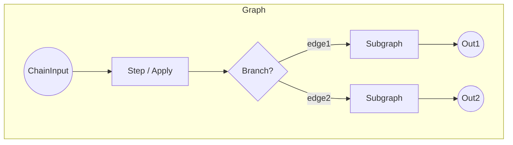

# Chainette Elegance Refactor Plan

> Branch: `elegance`

This document is the living blueprint for turning Chainette's execution core (Node → Step → Chain, etc.) into a cleaner, more algorithmically elegant architecture while preserving the guiding principles captured in `llm.txt`.

## 1 – Current State (June 2025)

### Strengths
1. **Type-safety** via Pydantic throughout.
2. JSON-schema guided decoding working for vLLM *and* Ollama.
3. Runs produce fully reproducible artefacts on disk.

### Pain Points
| Area | Issue |
|------|-------|
|Chain execution|Imperative loop with many `if`/`elif` branches, manual engine release; difficult to extend (e.g. nested branches, joins, async).|
|Node hierarchy|`Branch` is a special-cased list — not a first-class `Node`; violates LSP.| 
|Prompt building|Done inside `Step._build_prompt`, but `Step.execute` also manages batching, engine, histories — SRP violation.| 
|Engine life-cycle|Spread across `Chain` and `Step`; needs separation.| 
|Batching|Implemented per Step with indexes; cannot stream or parallelise easily.| 
|Error handling|Nested try/except, no structured failure propagation.| 

## 2 – Target Architecture



Key ideas:
1. **True DAG** of `Node`s. Each Node knows its downstream connections; `Chain` just keeps a root list.
2. **Composite pattern**: `Branch` (or any parallel container) is itself a `Node` holding an internal `Graph`.
3. **Execution engine**: separate service that walks the DAG depth-first or breadth-first, handles batching & engine reuse generically.
4. **Engine pool** abstraction with context-manager semantics; `Step` only asks for `with EnginePool(engine_name) as engine:`.
5. **PromptRenderer** utility class.
6. **BaseResult** object carries value *and* metadata (reasoning, timing, errors).

## Guiding Principle – Keep It Tiny & Readable

Chainette must remain a **tiny (~≤500 LOC core)**, approachable codebase:
• Favour explicit, straightforward constructs over clever abstractions.
• Each module should fit on one screen (<150 LOC) when possible.
• Zero hidden magic; public API ≈ internal flow.
• New dependencies require strong justification.

(Every change below must be evaluated against this principle.)

## 3 – Roadmap / TODO  (updated)

- [ ] **Design docs** – detailed diagrams + LOC budget for each new module.
- Graph layer
  - [x] Introduce `graph.py` with `Node`, `Edge`, `Graph` (<120 LOC).
  - [x] Provide `.connect(node)` helper for fluent graph building.
- Branch composite
  - [x] Refactor `Branch` → subclass `CompositeNode` in ≤40 LOC.
- Execution engine
  - [x] Create `executor.py` (≤150 LOC) with generic DAG walker.
  - [x] Batching/engine-reuse logic lives here; Step becomes thin wrapper.
  - [x] Batching/engine-reuse logic lives here; Step becomes thin wrapper.
    ```python
    # core/executor.py (excerpt)
    active_engine_name: str | None = None
    last_step_obj: Step | None = None

    # release engine when entering a branch or switching models
    if active_engine_name and (entering_branch or (upcoming_engine and upcoming_engine != active_engine_name)):
        get_engine_config(active_engine_name).release_engine()
        if last_step_obj is not None:
            last_step_obj.engine = None
        active_engine_name = None
        last_step_obj = None
    ```
- Prompt renderer
  - [x] `prompt.py` (≤80 LOC) – pure functions, no side-effects.
  - [x] `context.py` (≤50 LOC) – builds rendering context from histories.
- Engine pool
  - [x] `pool.py` (≤60 LOC) – context manager + simple LRU of live engines.
    ```python
    from chainette.engine.pool import ENGINE_POOL
    engine = ENGINE_POOL.acquire("gemma_ollama")
    ```
- Step refactor
  - [x] Remove batching/prompt logic; delegate to renderer & executor.
  - [x] Target ≤120 LOC total.
    ```python
    # core/step.py (excerpt)
    prompts = [build_prompt(self, hist) for hist in item_histories]
    parsed, reasoning = parse_llm_json(
        self.output_model, raw, engine_name=self.engine_name, step_id=self.id
    )
    ```
- Chain facade
  - [x] Keep current `Chain` API but proxy to `Graph`/`Executor`.
    ```python
    # core/chain.py (excerpt)
    graph = Graph(roots=graph_nodes[:1])
    executor = Executor(graph, batch_size=self.batch_size)
    histories = executor.run(inputs, writer, debug=debug)
    ```
- Error model
  - [x] Define `Result` dataclass with `value | error` (≤30 LOC).
    ```python
    # core/result.py
    @dataclass(slots=True)
    class Result(Generic[T]):
        value: Optional[T] = None
        error: Optional[Exception] = None
        @property
        def ok(self) -> bool: ...
    ```
- Async option
  - [x] Optional `AsyncExecutor` (≤120 LOC) using `anyio`.
    ```python
    # core/async_executor.py (excerpt)
    async def run(...):
        histories = await anyio.to_thread.run_sync(obj.execute, ...)
    ```
- Docs & style
  - [x] Update README + `llm.txt` to reflect new architecture.
  - [x] Add `CONTRIBUTING.md` emphasising simplicity rule.
- Tests
  - [x] Unit tests for graph traversal, pooling, renderer.
    ```python
    # tests/test_graph.py
    a.connect(b, c)
    g.validate_dag()
    ```
  - [x] Continuously expand `ollama_gemma_features.py` to cover new features (context vars).
    ```python
    # examples/ollama_gemma_features.py (excerpt)
    user_prompt="{{fr.translated}}"  # context var usage inside branch
    ```
  - [x] Static graph validation tests (model I/O compatibility).
    ```python
    # utils/validate.py -> validate_chain_io(chain)
    mismatches = validate_chain_io(my_chain)
    ```
- Logging
  - [x] Centralised structured logger with verbosity levels (<40 LOC).
    ```python
    from chainette.utils.logging import log, get
    log.info("step started", extra={"id": step.id})
    ```
- DSL / Builder
  - [x] Design a fluent DSL for pipeline construction using `>>` and `|` (module `dsl.py`).
  - [ ] Evaluate two syntaxes:
      1. **Operator DSL** (`>>`, `|`) pure-Python, no new deps.
      2. **Declarative dict/YAML** for data-driven chains (good for CLI).
  - [ ] Prototype operator DSL with minimal metaprogramming (<40 LOC).
  - [x] Prototype YAML loader that converts to `Graph` (<60 LOC).
    ```python
    from chainette.yaml_loader import load_chain
    chain = load_chain('my.yml', symbols=globals())
    ```
  - [x] Define YAML schema (engines, models, steps, branches) & example file.
  - [x] Extend CLI: `chainette run-yaml my_chain.yml -o out_dir` implemented.
  - [x] Add validation against JSON-Schema.
  - [x] `JoinBranch` subclass (≤15 LOC) that copies step outputs into parent histories.
  - [x] `Branch.join(alias)` helper returning a `JoinBranch`.
  - [x] Extend `Executor` to detect `JoinBranch` and merge `{alias: output}` per item.
  - [x] Update DSL: allow `(branch_a | branch_b).join(id="translations")` syntax.
  - [x] Unit tests `tests/test_join.py` covering merge semantics.
  - [x] Extend `ollama_gemma_features.py` with a join + downstream aggregator step.
  - [x] Add in "examples" folder new examples showcasing thoses features and check that they work.   Put examples in a nice folder structure.
  - [x] Docs: README section *Joins* + snippet in `llm.txt`.

    Snippet:
    ```md
    ### Branch Joins
    Merge outputs from parallel branches back into the main flow with `Branch.join(alias)`…
    ```

## Developer Workflow Checklist after each big refactor
1. `poetry install -E ollama`
2. Ensure `ollama serve` running with `gemma3:1b`.
3. After each core refactor commit:
   ```bash
   poetry run chainette run examples/ollama_gemma_features.py full_chain inputs2.jsonl _tmp_run_[iteration_number]
   ```
   - Expect to see DEBUG lines and final success message.
   - Inspect `_tmp_run/flattened/0.jsonl` etc. for translations.
   - really inspect the data in the files, check that the feature is working.
4. If test fails, fix before progressing to next TODO.
5. If test passes, commit and add below the checked item a snippet of the code that was changed.
6. If ollama_gemma_features.py doesn't cover the new feature, complement the script with something that does so at each step we check that the feature is working.

    ```python
    # examples/join/inc_dec_join.py (excerpt)
    inc_branch = Branch(name="inc_branch", steps=[inc_node]).join("inc")
    dec_branch = Branch(name="dec_branch", steps=[dec_node]).join("dec")
    inc_dec_chain = Chain(name="Increment/Decrement Join Demo", steps=[[inc_branch, dec_branch]])
    ```

## 4 – Alignment with Codebase Cleanup (`code-cleanup` branch)

The **Codebase Cleanup & Example Overhaul Plan** (`CODE_CLEANUP_PLAN.md`) runs in parallel and is intentionally **non-functional** (organisation-only).  It must land *before* any future elegance refactors that depend on leaner utils and the new example tree.  Always rebase `elegance` branch on top of `code-cleanup` once the cleanup checklist reaches 100 % completion.