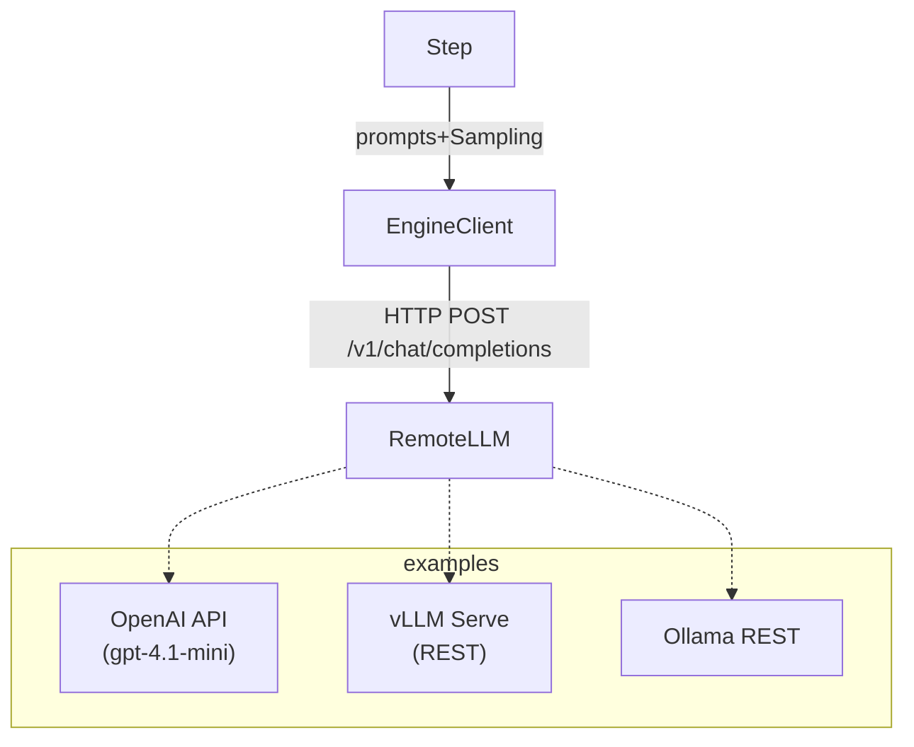

# Chainette Engine-API Refactor Plan

> Branch: `engine-api`

This living document designs the migration of Chainette's engine layer from **in-process vLLM objects** to **stateless HTTP API back-ends**.  The change unlocks:

• elastic scaling (run anywhere, easier GPU utilisation)<br/>
• cheap process isolation (can spin-up / kill engines via Docker / Kubernetes)<br/>
• simpler local dev: no CUDA install needed when using OpenAI ↔ remote vLLM

-----------------------------------------------------------------------------
## 0 – Context Snapshot (May 2025)

*Current* (`engine-refactor`):
• `EngineConfig` lazily instantiates a `vllm.LLM` or `OllamaLLM` python object.<br/>
• `EnginePool` + `EngineBroker` cache these heavy objects with an LRU.
• `Step.execute` calls `eng.generate(prompts, sampling_params)` and then
  `utils.parsing.parse_llm_json` to coerce into Pydantic models.

Limitations when we want remote HTTP engines:
1. Large GPU memory locked until Python exits.
2. Killing a model ≈ `engine.release()` → often still leaks VRAM.
3. Can't horizontally scale (each process has exactly one GPU).  
4. `enable_reasoning` piggy-backs on vLLM internal flags ⇒ unavailable elsewhere.

-----------------------------------------------------------------------------
## 1 – Design Goals

G1. **Backend-agnostic interface**: `Engine.generate()` signature remains
    `generate(prompts: list[str], sampling_params: SamplingParams) -> list[LLMOutput]` so
    *Step* stays unchanged.
G2. **Stateless client objects**: no heavy tensors stored; safe to keep in global
    registry without worrying about RAM/VRAM.
G3. **Structured output first**: rely on JSON schema (OpenAI `response_format` or
    vLLM `guided_decoding`) ↔ Pydantic validation – same contract as today.
G4. **Reasoning flag optional**: transparently disabled for back-ends that don't
    support it (OpenAI, current Ollama).
G5. **Timeout + retry handling** built-in; errors propagate as `Result(error=…)`.
G6. **Zero hidden magic**: implementation ≤ 150 LOC per backend.

-----------------------------------------------------------------------------
## 2 – Target Architecture

Key classes (new):
• `engine.http_client.OpenAIClient`
• `engine.http_client.VLLMClient`
• `engine.http_client.OllamaClient` (wraps existing but via REST)

Each exposes:
```python
class BaseHTTPClient:
    def generate(self, prompts: list[str], sampling_params: SamplingParams) -> list[LLMOutput]: ...
```
Implementation is small wrappers around `httpx.AsyncClient` (sync shim uses `anyio.run`).

-----------------------------------------------------------------------------
## 3 – Schema & Config

### 3.1 EngineConfig additions
```
endpoint: str | None   # e.g. "https://api.openai.com/v1"
api_key: str | None    # read from env if omitted
backend: Literal["openai", "vllm_api", "ollama_api"]
```
`EngineConfig.engine` now returns a light *client* – no longer a fat model.
Caching is optional ⇒ `EnginePool` is demoted to tiny dict of BaseHTTPClient.

### 3.2 YAML schema
```
- name: gpt4o
  backend: openai
  model: gpt-4.1-mini
  endpoint: https://api.openai.com/v1
  api_key_env: OPENAI_API_KEY        # optional helper
```

-----------------------------------------------------------------------------
## 4 – Migration Phases

1. **Phase A – OpenAI** (baseline)
   1. Implement `OpenAIClient` using `openai` ≥ 1.14.* **structured-output** helper `client.responses.parse`:
      ```python
      from openai import OpenAI
      from pydantic import BaseModel

      client = OpenAI(base_url=cfg.endpoint, api_key=cfg.api_key)

      class _OutModel(BaseModel):
          # This class will be generated dynamically from `Step.output_model`
          # at runtime, but shown here for illustration.
          ...

      response = client.responses.parse(
          model=cfg.model,
          input=[
              {"role": "system", "content": sp},
              {"role": "user", "content": up},
          ],
          text_format=_OutModel,
      )

      text = response.output_parsed  # instance of _OutModel
      ```
   2. Disable `GuidedDecodingParams` & `enable_reasoning` when `backend == "openai"`.
   3. Unit-test with mocked OpenAI (`pytest-recording` or `respx`).

2. **Phase B – vLLM Serve**
   1. Run `vllm.entrypoints.openai.api_server` (openai-compatible) – same payload as OpenAI.
   2. `VLLMClient` identical to OpenAI but no auth header.
   3. Provide `docs/vllm_server.md` how to launch Docker image.

3. **Phase C – Ollama HTTP**
   1. Use Ollama's `/api/chat` endpoint (already similar).
   2. Map sampling params (temperature, top_p).
   3. Keep existing in-proc wrapper for cases where user still wants local.

-----------------------------------------------------------------------------
## 5 – Refactor Roadmap / TODO Checklist
(We follow *one-item-at-a-time* loop: implement → test → tick → paste snippet.)

- [x] **1. Branch created** – `git checkout -b engine-api` *(done automatically)*.

### Phase A – OpenAI
- [x] **2. Add EngineConfig fields (`endpoint`, `api_key`, `backend`)**
  ```python
  # chainette/engine/registry.py (excerpt)
  @dataclass
  class EngineConfig:
      name: str
      model: str
      # ... existing code ...
      # HTTP-specific fields
      endpoint: Optional[str] = None
      api_key: Optional[str] = None
  ```
- [x] **3. Create module `engine/http_client.py` with `BaseHTTPClient` + `OpenAIClient`**
  ```python
  # chainette/engine/http_client.py (excerpt)
  class OpenAIClient(BaseHTTPClient):
      def generate(self, *, prompts: List[str], sampling_params=None):
          resp = self._client.chat.completions.create(
              model=self.model,
              messages=[{"role": "user", "content": prompts[0]}],
              response_format={"type": "json_object"},
          )
          text = resp.choices[0].message.content
          return [_RequestOutput(text)]
  ```
  and wired in `registry.EngineConfig.engine`:
  ```python
  elif self.backend == "openai":
      from chainette.engine.http_client import OpenAIClient
  ```
- [x] **4. Update `registry.EngineConfig.engine` to return `OpenAIClient` when backend == "openai"**
- [x] **5. Guard `GuidedDecodingParams` & `enable_reasoning` in `Step.__init__`**
    ```python
    cfg = get_engine_config(self.engine_name)  # may raise KeyError if not yet registered
    if cfg is None or cfg.backend != "openai":
        self.sampling.guided_decoding = GuidedDecodingParams(json=json_schema)
    ```
- [x] **6. Write tests `tests/test_openai_client.py` with `respx` mocks**
- [x] **7. Update CLI docs & README (OpenAI usage)**

### Phase B – vLLM Serve
- [x] **8. Implement `VLLMClient` (+ unit tests)**
- [ ] **9. Add CLI helper `chainette engines warmup vllm_api` (spins docker) – optional**
- [ ] **10. Benchmark parity vs local vLLM (doc in `BENCHMARK.md`)**

### Phase C – Ollama HTTP
- [x] **11. Implement `OllamaHTTPClient` & reuse existing prompt mapping**
- [x] **12. Consolidate duplicated code into `BaseHTTPClient._chat(payload)`**

### Cleanup & Deprecation
- [x] **13. Deprecate `enable_reasoning` for backends that don't support**
- [x] **14. Remove vLLM in-proc path (may live behind `backend: vllm_local`)**
- [ ] **15. Update `ELEGANCE_PLAN.md` & docs**

-----------------------------------------------------------------------------
## 6 – Risks & Mitigations

| Risk | Mitigation |
|------|------------|
| **Rate limits / 429** | Exponential back-off in `OpenAIClient.generate` + global max concurrency semaphore. |
| **Cost explosion** | `Step` logs token counts (OpenAI returns usage).
| **JSON parse errors** (OpenAI doesn't do guided decoding) | still validate with Pydantic; retry once with *system* instruction appended "Respond ONLY in JSON". |
| **Timeouts** | `engine.runtime.execute_with_timeout` reused; per-backend default 60 s. |
| **Security: API keys in logs** | Ensure we scrub headers before logging. |
| **Thread-safety** | clients are stateless; safe to reuse across threads. |

-----------------------------------------------------------------------------
## 7 – Testing Strategy

• Unit: stub HTTP responses to cover happy-path + failures.<br/>
• Integration: `examples/openai_structured.py` – run against live OpenAI.<br/>
• CLI smoke: `poetry run chainette run-yaml examples/engine_clinical_qa.yaml` vs OpenAI.

-----------------------------------------------------------------------------
## 8 – Glossary

| Term | Meaning |
|------|---------|
| **Backend** | Logical type of engine implementation (openai, vllm_api, ollama_api, vllm_local). |
| **EngineClient** | Thin wrapper with `.generate()` bridging Chainette ↔ HTTP API. |
| **Structured Output** | The practice of forcing LLMs to emit JSON conforming to a Pydantic schema. |


-----------------------------------------------------------------------------
### End-of-File 