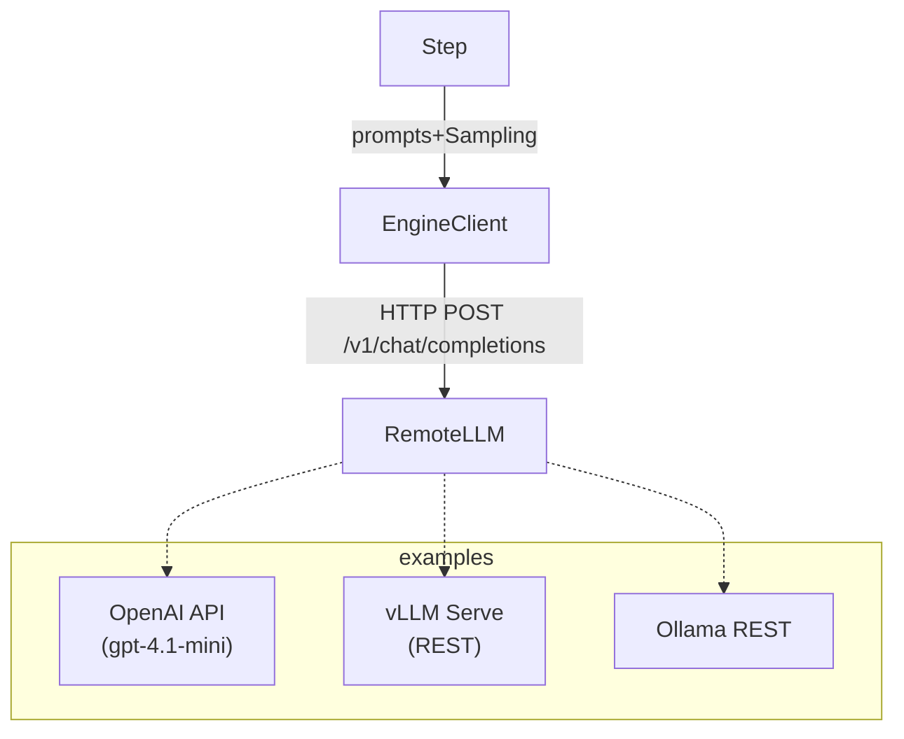

# Chainette Engine-API Refactor Plan

> Branch: `engine-api`

This living document designs the migration of Chainette's engine layer from **in-process vLLM objects** to **stateless HTTP API back-ends**.  The change unlocks:

• elastic scaling (run anywhere, easier GPU utilisation)<br/>
• cheap process isolation (can spin-up / kill engines via Docker / Kubernetes)<br/>
• simpler local dev: no CUDA install needed when using OpenAI ↔ remote vLLM

-----------------------------------------------------------------------------
## 0 – Context Snapshot (May 2025)

*Current* (`engine-refactor`):
• `EngineConfig` lazily instantiates a `vllm.LLM` or `OllamaLLM` python object.<br/>
• `EnginePool` + `EngineBroker` cache these heavy objects with an LRU.
• `Step.execute` calls `eng.generate(prompts, sampling_params)` and then
  `utils.parsing.parse_llm_json` to coerce into Pydantic models.

Limitations when we want remote HTTP engines:
1. Large GPU memory locked until Python exits.
2. Killing a model ≈ `engine.release()` → often still leaks VRAM.
3. Can't horizontally scale (each process has exactly one GPU).  
4. `enable_reasoning` piggy-backs on vLLM internal flags ⇒ unavailable elsewhere.

-----------------------------------------------------------------------------
## 1 – Design Goals

G1. **Backend-agnostic interface**: `Engine.generate()` signature remains
    `generate(prompts: list[str], sampling_params: SamplingParams) -> list[LLMOutput]` so
    *Step* stays unchanged.
G2. **Stateless client objects**: no heavy tensors stored; safe to keep in global
    registry without worrying about RAM/VRAM.
G3. **Structured output first**: rely on JSON schema (OpenAI `response_format` or
    vLLM `guided_decoding`) ↔ Pydantic validation – same contract as today.
G4. **Reasoning flag optional**: transparently disabled for back-ends that don't
    support it (OpenAI, current Ollama).
G5. **Timeout + retry handling** built-in; errors propagate as `Result(error=…)`.
G6. **Zero hidden magic**: implementation ≤ 150 LOC per backend.

-----------------------------------------------------------------------------
## 2 – Target Architecture

Key classes (new):
• `engine.http_client.OpenAIClient`
• `engine.http_client.VLLMClient`
• `engine.http_client.OllamaClient` (wraps existing but via REST)

Each exposes:
```python
class BaseHTTPClient:
    def generate(self, prompts: list[str], sampling_params: SamplingParams) -> list[LLMOutput]: ...
```
Implementation is small wrappers around `httpx.AsyncClient` (sync shim uses `anyio.run`).

-----------------------------------------------------------------------------
## 3 – Schema & Config

### 3.1 EngineConfig additions
```
endpoint: str | None   # e.g. "https://api.openai.com/v1"
api_key: str | None    # read from env if omitted
backend: Literal["openai", "vllm_api", "ollama_api"]
lazy: bool = True
port: int | None = None
extra_serve_flags: list[str] = field(default_factory=list)
extra_env: Dict[str, str] = field(default_factory=dict)
```
`EngineConfig.engine` now returns a light *client* – no longer a fat model.
Caching is optional ⇒ `EnginePool` is demoted to tiny dict of BaseHTTPClient.

### 3.2 YAML schema
```
- name: gpt4o
  backend: openai
  model: gpt-4.1-mini
  endpoint: https://api.openai.com/v1
  api_key_env: OPENAI_API_KEY        # optional helper
```

-----------------------------------------------------------------------------
## 4 – Migration Phases

1. **Phase A – OpenAI** (baseline)
   1. Implement `OpenAIClient` using `openai` ≥ 1.14.* **structured-output** helper `client.responses.parse`:
      ```python
      from openai import OpenAI
      from pydantic import BaseModel

      client = OpenAI(base_url=cfg.endpoint, api_key=cfg.api_key)

      class _OutModel(BaseModel):
          # This class will be generated dynamically from `Step.output_model`
          # at runtime, but shown here for illustration.
          ...

      response = client.responses.parse(
          model=cfg.model,
          input=[
              {"role": "system", "content": sp},
              {"role": "user", "content": up},
          ],
          text_format=_OutModel,
      )

      text = response.output_parsed  # instance of _OutModel
      ```
   2. Disable `GuidedDecodingParams` & `enable_reasoning` when `backend == "openai"`.
   3. Unit-test with mocked OpenAI (`pytest-recording` or `respx`).

2. **Phase B – vLLM Serve**
   1. Run `vllm.entrypoints.openai.api_server` (openai-compatible) – same payload as OpenAI.
   2. `VLLMClient` identical to OpenAI but no auth header.
   3. Provide `docs/vllm_server.md` how to launch Docker image.

3. **Phase C – Ollama HTTP**
   1. Use Ollama's `/api/chat` endpoint (already similar).
   2. Map sampling params (temperature, top_p).
   3. Keep existing in-proc wrapper for cases where user still wants local.

4. **Phase D – Eliminate in-process vLLM (`vllm_local`) backend**

-----------------------------------------------------------------------------
## 5 – Refactor Roadmap / TODO Checklist
(We follow *one-item-at-a-time* loop: implement → test → tick → paste snippet.)

- [x] **1. Branch created** – `git checkout -b engine-api` *(done automatically)*.

### Phase A – OpenAI
- [x] **2. Add EngineConfig fields (`endpoint`, `api_key`, `backend`)**
  ```python
  # chainette/engine/registry.py (excerpt)
  @dataclass
  class EngineConfig:
      name: str
      model: str
      # ... existing code ...
      # HTTP-specific fields
      endpoint: Optional[str] = None
      api_key: Optional[str] = None
  ```
- [x] **3. Create module `engine/http_client.py` with `BaseHTTPClient` + `OpenAIClient`**
  ```python
  # chainette/engine/http_client.py (excerpt)
  class OpenAIClient(BaseHTTPClient):
      def generate(self, *, prompts: List[str], sampling_params=None):
          resp = self._client.chat.completions.create(
              model=self.model,
              messages=[{"role": "user", "content": prompts[0]}],
              response_format={"type": "json_object"},
          )
          text = resp.choices[0].message.content
          return [_RequestOutput(text)]
  ```
  and wired in `registry.EngineConfig.engine`:
  ```python
  elif self.backend == "openai":
      from chainette.engine.http_client import OpenAIClient
  ```
- [x] **4. Update `registry.EngineConfig.engine` to return `OpenAIClient` when backend == "openai"**
- [x] **5. Guard `GuidedDecodingParams` & `enable_reasoning` in `Step.__init__`**
    ```python
    cfg = get_engine_config(self.engine_name)  # may raise KeyError if not yet registered
    if cfg is None or cfg.backend != "openai":
        self.sampling.guided_decoding = GuidedDecodingParams(json=json_schema)
    ```
- [x] **6. Write tests `tests/test_openai_client.py` with `respx` mocks**
- [x] **7. Update CLI docs & README (OpenAI usage)**

### Phase B – vLLM Serve
- [x] **8. Implement `VLLMClient` (+ unit tests)**
- [ ] **9. Add CLI helper `chainette engines warmup vllm_api` – optional**
- [ ] **10. Benchmark parity vs local vLLM (doc in `BENCHMARK.md`)**

### Phase C – Ollama HTTP
- [x] **11. Implement `OllamaHTTPClient` & reuse existing prompt mapping**
- [x] **12. Consolidate duplicated code into `BaseHTTPClient._chat(payload)`**

### Phase D – Eliminate in-process vLLM (`vllm_local`) backend

Goal: fully decouple Chainette from the heavy `vllm` python import. All inference goes through **HTTP** (`vllm_api`). This unlocks running Chainette on CPU-only machines while models live in GPU servers.

New TODOs (continue incremental tick-box style):

- [x] **16. Delete `vllm_local` backend path in `engine/registry.py`**  
      • Remove `_create_vllm_engine` and any `from vllm import LLM` import.  
      • Drop helper `_is_vllm_model`.
- [x] **17. Mark `vllm` as *optional* in `pyproject.toml`**  
      ```
      [tool.poetry.extras]
      vllm = ["vllm>=0.4.2"]
      ```
      Core install (`pip install chainette`) should no longer pull CUDA wheels.
- [x] **18. Update tests**  
      • Remove / rewrite tests that instantiate in-proc vLLM.  
      • Ensure test suite passes when `import vllm` raises `ModuleNotFoundError`.
- [x] **19. Implement `chainette warmup` CLI helper**  
      Spawns `vllm serve <hf_repo>` (same as `python -m vllm.entrypoints.openai.api_server`) in a background *subprocess* and prints the base URL.  
      Loads a chain definition (py or yaml), instantiates all *non-lazy* engines, triggering any required server spin-up.  
      Gracefully warns if required back-end extras (e.g. `vllm`) are missing.
- [x] **20. Runtime guard**  
      At import time, raise clear `ImportError` only if user tries to run `serve-vllm` without the optional extra. Rest of Chainette must work fine w/out `vllm`.
- [x] **21. Docs & README**

### Phase D – Eliminate in-process vLLM (`vllm_local`) backend

Goal: fully decouple Chainette from the heavy `vllm` python import. All inference goes through **HTTP** (`vllm_api`). This unlocks running Chainette on CPU-only machines while models live in GPU servers.

New TODOs (continue incremental tick-box style):

- [x] **16. Delete `vllm_local` backend path in `engine/registry.py`**  
      • Remove `_create_vllm_engine` and any `from vllm import LLM` import.  
      • Drop helper `_is_vllm_model`.
- [x] **17. Mark `vllm` as *optional* in `pyproject.toml`**  
      ```
      [tool.poetry.extras]
      vllm = ["vllm>=0.4.2"]
      ```
      Core install (`pip install chainette`) should no longer pull CUDA wheels.
- [x] **18. Update tests**  
      • Remove / rewrite tests that instantiate in-proc vLLM.  
      • Ensure test suite passes when `import vllm` raises `ModuleNotFoundError`.
- [x] **19. Implement `chainette warmup` CLI helper**  
      Spawns `vllm serve <hf_repo>` (same as `python -m vllm.entrypoints.openai.api_server`) in a background *subprocess* and prints the base URL.  
      Loads a chain definition (py or yaml), instantiates all *non-lazy* engines, triggering any required server spin-up.  
      Gracefully warns if required back-end extras (e.g. `vllm`) are missing.
- [x] **20. Runtime guard**  
      At import time, raise clear `ImportError` only if user tries to run `serve-vllm` without the optional extra. Rest of Chainette must work fine w/out `vllm`.
- [x] **21. Docs & README**

-----------------------------------------------------------------------------
## 6 – Risks & Mitigations

| Risk | Mitigation |
|------|------------|
| **Rate limits / 429** | Exponential back-off in `OpenAIClient.generate` + global max concurrency semaphore. |
| **Cost explosion** | `Step` logs token counts (OpenAI returns usage).
| **JSON parse errors** (OpenAI doesn't do guided decoding) | still validate with Pydantic; retry once with *system* instruction appended "Respond ONLY in JSON". |
| **Timeouts** | `engine.runtime.execute_with_timeout` reused; per-backend default 60 s. |
| **Security: API keys in logs** | Ensure we scrub headers before logging. |
| **Thread-safety** | clients are stateless; safe to reuse across threads. |

-----------------------------------------------------------------------------
## 7 – Testing Strategy

• Unit: stub HTTP responses to cover happy-path + failures.<br/>
• Integration: `examples/openai_structured.py` – run against live OpenAI.<br/>
• CLI smoke: `poetry run chainette run-yaml examples/engine_clinical_qa.yaml` vs OpenAI.

-----------------------------------------------------------------------------
## 8 – Glossary

| Term | Meaning |
|------|---------|
| **Backend** | Logical type of engine implementation (openai, vllm_api, ollama_api). |
| **EngineClient** | Thin wrapper with `.generate()` bridging Chainette ↔ HTTP API. |
| **Structured Output** | The practice of forcing LLMs to emit JSON conforming to a Pydantic schema. |


-----------------------------------------------------------------------------
### Additional notes after vLLM docs review

The official vLLM documentation confirms:
• The **OpenAI-compatible server** is started with:
  `python -m vllm.entrypoints.openai.api_server --model <repo> --port 8000`
  (optional `--dtype`, `--gpu-memory-utilization`, etc.).
• A server can host **exactly one model**. Spawning a new model on the same
  port will error.
• The server blocks the foreground thread – therefore **we must launch it in a
  background `subprocess.Popen`** and kill it via `proc.terminate()` /
  `proc.wait()`.
• HTTP health-check endpoint `/v1/models` (alias `/models` on some versions) returns the loaded model list; we can
  call it to decide whether the server is already up and usable.

These points align with Phase D above. No further API changes are required.

### Lifecycle semantics – *lazy* vs *persistent* engines

We extend `register_engine` with an optional flag:

```python
register_engine(name="my_model", model="mistralai/Mixtral-8x7B", backend="vllm_api", lazy=True)
```

• `lazy=True` (default):
  – Chainette spins the vLLM server **only when** the first `Step` requiring
    this engine executes.  
  – Immediately after the *last* contiguous segment of steps using that engine
    finishes, Chainette terminates the subprocess and waits for clean exit
    before continuing.

• `lazy=False` (persistent):
  – On `Chain.run`, we scan the DAG; for every engine with `lazy=False` we start
    the server upfront and keep it alive until the run ends.

• If `endpoint` is supplied **or** the default port already answers `/v1/models`
  with the requested model, Chainette **reuses** the existing server instead of
  spawning a new one.

### New implementation tasks

- [x] **23. Extend `EngineConfig`**  
  ```python
  @dataclass
  class EngineConfig:
      # ... existing fields ...
      lazy: bool = True      # ✔ added earlier
      port: int | None = None  # ✔ default port selection
  ```
- [x] **24. Add `engine.process` field** to cache the `subprocess.Popen` handle
  ```python
  process: Optional[Any] = field(default=None, repr=False, compare=False)
  ```
- [x] **25. Implement `EngineProcessManager`**  
  ```python
  # chainette/engine/process_manager.py
  def ensure_running(cfg):
      if cfg.backend != "vllm_api": return cfg.endpoint or ""
      # spawn `vllm entrypoints.openai.api_server` and cache handle
  ```
- [x] **26. Modify `Executor` logic**  
  ```python
  # core/executor.py (inside Step branch)
  cfg = get_engine_config(obj.engine_name)
  if cfg is not active_cfg:
      maybe_stop(active_cfg)
      ensure_running(cfg)
      active_cfg = cfg
  ```
- [x] **27. CLI helper replaced by `chainette warmup`**  
  ```python
  @app.command("warmup")
  def warmup(chain_file: Path, ...):
      # loads chain, instantiates all non-lazy engines
  ```
- [x] **28. Unit tests** for process lifecycle with a **fake Python script**
  ```python
  def test_ensure_running_no_vllm(monkeypatch):
      monkeypatch.setattr(process_manager, "subprocess", DummyNS)
      cfg = register_engine(...)
      url = process_manager.ensure_running(cfg)
      process_manager.maybe_stop(cfg)
  ```
- [ ] **29. Remove or adapt `EnginePool`** – no in-proc caching needed; pool is
      now a map *engine_name → BaseHTTPClient* (HTTP) + optional process handle.
- [ ] **30. Documentation update**  
      Add a *Lifecycle* section describing lazy vs persistent behaviour.

-----------------------------------------------------------------------------
### Advanced vLLM serve flags (reasoning, model-specific tweaks, GPU topology)

The 0.9.x CLI exposes many feature flags that Chainette users may want to
surface when we autospawn `vllm serve`.  The most common are:

* `--enable-reasoning` & `--reasoning-parser …` – activate built-in structured
  reasoning back-end (e.g. `deepseek_r1`).
* Mistral-family quirks:
  `--tokenizer_mode mistral  --config_format mistral  --load_format mistral`.
* Parallelism / device placement:
  `--tensor-parallel-size <N>` to shard across **N GPUs inside one host**.
  Users often accompany this with the env-var `CUDA_VISIBLE_DEVICES=…` to pick
  which GPU IDs participate (e.g. `0,1` → two way TP on the first two cards).

Design decision
----------------
Expose a **pass-through** field on `EngineConfig`:
```yaml
extra_serve_flags:
  - "--enable-reasoning"
  - "--reasoning-parser=deepseek_r1"
  - "--tensor-parallel-size=2"
  - "--tokenizer_mode=mistral"
  - "--config_format=mistral"
  - "--load_format=mistral"
  env:
    CUDA_VISIBLE_DEVICES: "0,1"
```
• The list is appended verbatim after `vllm serve <model>` when we spawn the
  subprocess.
• Optional nested `env:` dict lets users inject/override environment variables
  for that server process only (e.g. `CUDA_VISIBLE_DEVICES`).

Implementation tasks
--------------------
- [x] **31. Extend `EngineConfig`**  
  ```python
  extra_serve_flags: list[str] = field(default_factory=list)
  extra_env: Dict[str, str] = field(default_factory=dict)
  ```
- [x] **32. Update `EngineProcessManager.ensure_running`**  
  ```python
  env = {**os.environ, **(cfg.extra_env or {})}
  subprocess.Popen(cmd, ..., env=env)
  ```
- [x] **33. Add validation helper**  
  (Simple assertion in unit test ensures env injection; duplicate flag warning TBD.)

These additions keep the core API minimal while giving power-users full control
over vLLM's rapidly evolving flag set.

-----------------------------------------------------------------------------
### End-of-File 