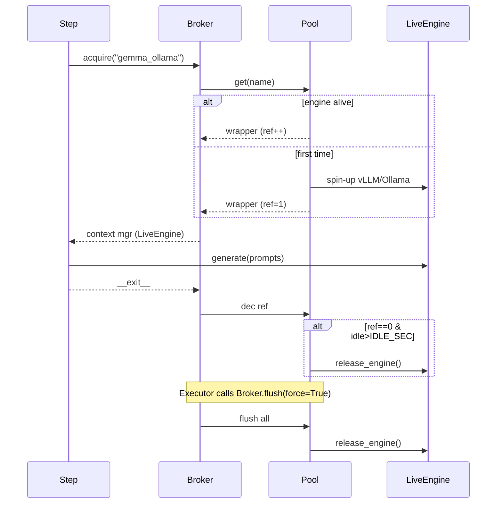

# Engine Broker / Pool – Design Doc

> Companion to `ENGINE_PLAN.md`

This doc provides a concise **sequence diagram** of request/flush flow and a quick **LOC budget** reference.

## Sequence – acquire / release / flush

## File Layout & LOC budget

| File | Purpose | Max LOC |
|------|---------|---------|
| `engine/broker.py` | acquire / flush wrappers | **≤ 80** |
| `engine/engine_pool.py` | ref-count, idle timing | **≤ 70** |
| `core/step.py` diff | replace `self.engine` usage | **+30** |
| `core/executor.py` diff | remove engine switch, add flush | **–40** |

Total new code ≤ **140 LOC**, net core diff negative.

---

*Last updated: 2025-06-16* 