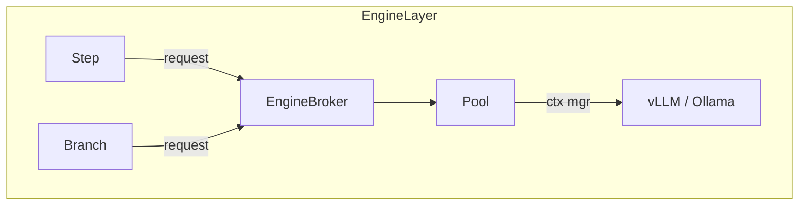

# Chainette Engine Elegance Plan  
> Branch: `engine-refactor` (branched from `runner`)

This blueprint fixes lazy-load / release logic and removes the redundant  
`input_model` field—while staying tiny and readable per **llm.txt**.

---

## 1 – Problems Today (June 2025)

| Area          | Issue                                                                                                      |
|---------------|------------------------------------------------------------------------------------------------------------|
| Lazy spin-up  | `Step` spins engines, `Executor` sometimes releases ⇒ double-duty, bugs on branch model-switch.            |
| Release       | `release_engine()` sprinkled around; leaks GPU mem on failures.                                            |
| Pooling       | `pool.py` LRU lacks ref-count; branch can kill engine still in use.                                        |
| Schema        | Every node asks for `input_model`, but full history is available ⇢ field is noise.                         |

---

## 2 – Target Design (≤ 300 LOC)



### Components

1. **`engine/broker.py`** (≤ 80 LOC)  
   * `with acquire(name) as eng:` – returns live engine, bumps `ref_count`.  
   * `flush(force=False)` – releases idle engines or all when `force=True`.

2. **`engine/engine_pool.py`** (≤ 70 LOC)  
   * Dict `name → LiveEngineWrapper(engine, ref_count, last_used_ts)`.  
   * Wrapper's `__exit__` decrements count; 0 ⇒ eligible for flush.

3. **Policy constants** (≤ 20 LOC)  
   * `IDLE_SEC = 180` etc.

4. **Step changes** (≤ 30 LOC diff)

   ```python
   from chainette.engine.broker import EngineBroker

   with EngineBroker.acquire(self.engine_name) as eng:
       raw = eng.generate(prompts, self.sampling)
   ```

5. **Executor cleanup** (≤ 20 LOC diff)  
   * Remove manual engine-switch block.  
   * Call `EngineBroker.flush(force=True)` at run end.

6. **Drop `input_model`** (≤ 60 LOC total edits)  
   * Delete arg from `Step` / `ApplyNode`; examples & CLI updated.  
   * CLI: if first node is Apply with no declared model, parse inputs as `dict` and warn.

---

## 3 – Roadmap / TODO

- [ ] **Design docs** – sequence diagram + LOC budget table.  
- Engine layer  
  - [x] `broker.py` with `acquire/flush`.  
  - [x] Refactor current `pool.py` ⇒ `engine_pool.py` (+ ref-count).  
  - [x] Unit tests for ref-count & idle flush.  
- Nodes  
  - [x] Update `Step` / `ApplyNode` to **optional** `input_model` and switched `Step` to `EngineBroker.acquire`.  
  - [ ] Hard removal of `input_model` postponed (compatibility).  
- Executor  
  - [ ] Strip engine-switch logic; final `flush(force=True)`.  
- CLI  
  - [ ] Raw-dict fallback when first node lacks explicit model.  
- Docs  
  - [ ] README + `llm.txt` section *Engine Broker*.  
- Examples/tests  
  - [ ] Update Gemma & huge_batch_demo.  
  - [ ] Stress test with 3 parallel branches (mock engines).

---

## 4 – LOC Budget

| Module                    | Max LOC |
|---------------------------|---------|
| `engine/broker.py`        | ≤ 80 |
| `engine/engine_pool.py`   | ≤ 70 |
| `core/step.py` diff       | +30 |
| `core/executor.py` diff   | –40 (cleanup) |
| other diffs               | minimal |

---

## 5 – Acceptance Criteria

1. Switching models/branches never leaks GPU memory.  
2. 3-branch mock chain shows correct ref-counts during run.  
3. `huge_batch_demo` (1 M rows) stays < 500 MB RAM.  
4. All tests (`pytest -q`) pass.

---

## 6 – Developer Workflow Checklist

1. `poetry install -E ollama`  
2. Ensure `ollama serve` with `gemma3:1b`.  
3. After each checked item:  

   ```bash
   poetry run chainette run examples/runner/huge_batch_demo.py demo_chain inputs_huge.jsonl _tmp_run_engine --stream-writer --quiet
   pytest -q
   ```  

4. Inspect `_tmp_run_engine/flattened/` files.  
5. Commit & paste code snippet below the item in this plan.
