# Engine UI Enhancement – Display Engines in DAG & Runtime

## Goal Summary
Enhance Chainette's Rich UI so that:
1. The execution DAG tree prints the engine responsible for each `Step` in a concise, visually appealing way.
2. During execution, the console clearly notifies when an engine is started, reused, or released (evicted/killed).

This provides users immediate feedback about resource utilisation and backend provenance.

## Potential Issues & Traps
- **Test snapshots become outdated** – existing DAG rendering tests may need adjusting; ensure the new labels don't break tests that rely only on step IDs.
- **Circular import risk** – adding logging inside `engine.registry` could create import loops; mitigate by importing `console` lazily inside methods.
- **Verbosity creep** – messages must remain crisp; avoid flooding the console especially when many steps reuse the same engine.

## Design Flowchart

```mermaid
sequenceDiagram
    participant User
    participant Chain as Chain.execute()
    participant Step as Step.execute()
    participant Broker as EngineBroker
    participant Pool as EnginePool
    participant Reg as EngineConfig
    User->>Chain: prints DAG tree (show_dag_tree)
    Chain->>UI: build_rich_tree() – include engine label
    Step->>Broker: acquire(engine_name)
    Broker->>Pool: acquire()
    Pool->>Reg: cfg.engine (lazy)
    Reg-->>Reg: <if _engine None> create instance
    Reg->>UI: console.print("🚀 Engine X started")
    Pool-->>Broker: engine instance
    Broker-->>Step: engine
    Note right of Step: LLM call …
    Step->>Broker: release (context mgr exit)
    alt LRU eviction or flush()
        Pool->>Reg: release_engine()
        Reg->>UI: console.print("🗑️ Engine X released")
    end
```


## Project Structure
```
chainette/
├─ engine/
│  ├─ registry.py   # add start/release console prints
│  └─ engine_pool.py # eviction prints handled via registry.release_engine
├─ utils/
│  ├─ dag.py        # show engine label in tree
│  └─ logging.py    # existing console helper reused
tests/
└─ test_dag_engine_label.py  # new unit test verifying engine label appears
```

## Implementation Tasks

### Completed
- [x] Write this implementation plan

### In Progress
- [ ] Update `utils/dag.build_rich_tree()` to append engine label when `obj` has `engine_name`
- [ ] Inject start/release notifications inside `EngineConfig.engine` and `EngineConfig.release_engine`
- [ ] Add concise emojis/text: 🚀 start, ♻️ reuse (optional), 🗑️ release
- [ ] Create unit test `test_dag_engine_label.py` that constructs a minimal `Step` with registered engine and asserts tree contains engine label
- [ ] Ensure `tests/*` snapshots unaffected or adjust expectations

### Future Tasks
- [ ] Optional: expose hooks for custom UI themes

## Reasoning
Minimal invasive changes (~20 LOC) deliver high user value while adhering to simplicity-first and single-responsibility principles. 